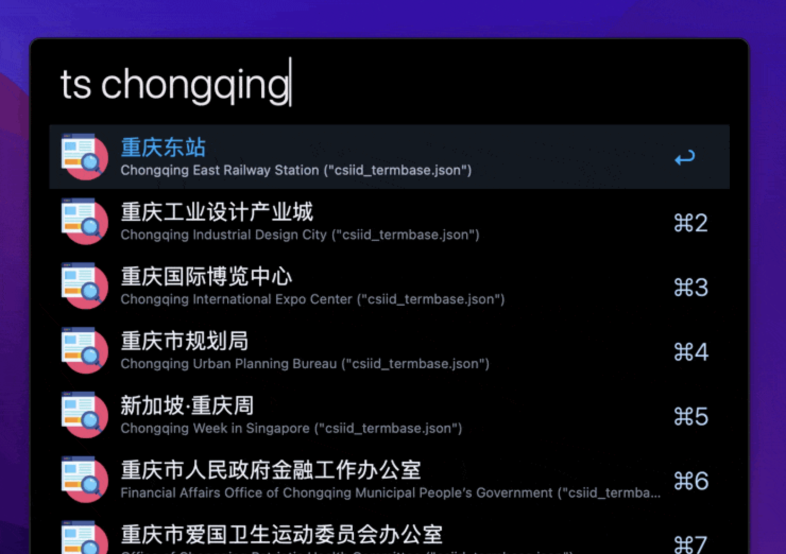

# TermSearch
An Alfred workflow that allows you to easily manage and look up translations from termbases. Supports both English and Chinese searching, and fuzzy matching is enabled for English matching. Supports "Reverse Search" where you can look up a target text and the corresponding source text will be returned. Also supports pinyin matching for Chinese searches.

## Dependencies

- Python
- Install [thefuzz](https://github.com/seatgeek/thefuzz) using `pip install thefuzz` (Ensure that you install it with the specific Python that Alfred uses. Open any of the Script Filter objects to check the Python path). This is required for fuzzy matching.

## Core Features
- **Term Search**: Looks up a term from all .json files in your temrbase directory. English is matched fuzzily using the fuzziness value specified in the configuration. Chinese is matched more naively to simply see if at least one character matches. Pinyin is also supported for Chinese searches (same naive matching).

- **Add Entry**: Add TT to an existing ST entry, or add an entirely new ST entry to a specified termbase.

- **Delete Entry**: Delete a TT from an existing ST entry, or delete an entire ST entry.

- **Load CSV File**: Converts a CSV file into JSON format, which will be saved under the specified termbase directory.

- **Convert Excel file to CSV**: Converts a given XLSX file into CSV format. The subsequent script will help to eliminate empty cells, but it is recommended that the user check it manually (resulting file will pop up).

## Known Issues
- Results aren't arranged by exactness of match. Can be problematic for very short queries. This can't be resolved entirely as Alfred learns result order by usage.
- Pinyin conversion is inaccurate for certain words. This is a tokenization problem that cannot be completely resolved. You may explicitly specify known incorrect transcriptions in the `replace_d.json` in the workflow directory.
